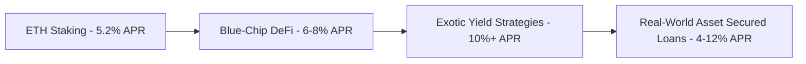

# How Will the DeFi Lending Sector Evolve? Exploring 5 Key Areas Including Banking and ETH Staking Rates

DeFi lending protocols have emerged as transformative forces in financial services, challenging traditional banking models while introducing novel mechanisms for capital allocation. This analysis explores five critical dimensions shaping DeFi lending's future: banking integration, ETH staking dynamics, yield curve development, undercollateralized lending innovations, and central bank digital currency (CBDC) implications. By examining these areas through both technical and socioeconomic lenses, we uncover opportunities for financial system modernization while addressing implementation challenges.

---

## 1. The Future of Traditional Banking in a DeFi World

**Will banks become obsolete?**  
Contrary to popular predictions of "bankless" futures, traditional financial institutions will remain vital infrastructure components. The DeFi ecosystem currently depends on regulated entities for fiat-crypto on/off-ramps, with over 98% of DeFi transactions maintaining fiat connectivity through centralized intermediaries.

**Key Evolutionary Trajectory:**  
Banks will adopt DeFi protocols as modular infrastructure components rather than competitors. This transformation mirrors Microsoft's integration of Linux - where open-source technology enhances proprietary offerings without displacing them. Community banks lacking technical resources can leverage DeFi SDKs to offer services like automated liquidity provision and programmable yield strategies at minimal cost.

**Industry Consolidation Trends:**  
U.S. banking data reveals structural shifts:
| Year | Total Banks | Small Banks (Assets < $1B) | Large Banks (Assets > $250B) |
|------|-------------|---------------------------|-----------------------------|
| 1984 | 14,300      | 12,155 (85%)              | 12 (0.08%)                  |
| 2023 | 4,236       | 2,203 (52%)               | 22 (0.52%)                  |

*Data Sources: FDIC, NCRC*

This consolidation creates opportunities for DeFi to democratize access to financial services, enabling smaller institutions to compete with mega-banks through protocol-based service layers.

**FAQ: How can banks integrate DeFi without technical expertise?**  
Banks can utilize DeFi-as-a-Service platforms offering API integrations for services like automated market making, yield optimization, and cross-chain asset transfers. These solutions abstract complex blockchain interactions behind traditional banking interfaces.

---

## 2. ETH Staking and DeFi Yield Curve Development

**Post-Merge Staking Dynamics:**  
Ethereum's transition to Proof-of-Stake created a foundational yield benchmark. Current staking rewards (~5.2% APR) represent a risk-adjusted floor for DeFi yields, analogous to the U.S. Treasury bond market in traditional finance.

**Yield Curve Implications:**  
As DeFi matures, we're observing yield stratification:

This structure enables capital allocators to choose risk-reward profiles comparable to traditional fixed-income markets. The key distinction lies in programmable yield components - stakers simultaneously gain governance rights and protocol upside exposure.

**FAQ: How does ETH staking compare to traditional fixed income?**  
While both offer yield, ETH staking combines income generation with asset appreciation potential. However, price volatility introduces directional risk absent in fiat-denominated bonds. Sophisticated investors may hedge this exposure through derivatives markets.

---

## 3. Fixed-Rate Lending and Interest Rate Swaps

**The Need for Certainty:**  
Variable rates dominate current DeFi lending, creating planning challenges for borrowers. Traditional finance addresses this through $500+ trillion interest rate swap markets - a model now replicating on-chain.

**Emerging Solutions:**  
Protocols like Voltz enable:
- Fixed-rate loan origination through AMM-based derivative markets
- Duration-specific yield products (e.g., 12-month fixed deposits)
- Basis swaps between crypto-native and traditional asset classes

**Structural Advantages:**  
On-chain derivatives eliminate counterparty risk through overcollateralization while maintaining capital efficiency via dynamic margin requirements. This represents a 200-300 basis point improvement over legacy infrastructure.

**FAQ: Why would businesses prefer DeFi fixed-rate loans?**  
Smart contract-enforced terms reduce operational friction, while transparent pricing mechanisms eliminate information asymmetry between lenders and borrowers. DAO treasuries particularly benefit from predictable financing costs.

👉 [Explore DeFi Yield Opportunities](https://bit.ly/okx-bonus)

---

## 4. Undercollateralized Loans and Tokenized Real-World Assets

**Current Collateral Paradigm:**  
Existing DeFi lending requires 150-200% overcollateralization, limiting capital efficiency. This structure works for crypto-native assets but fails to accommodate productive real-world assets.

**Innovation Frontiers:**  
1. **Tokenized Real Estate:** Commercial properties represented as NFTs with embedded cashflow rights
2. **Invoice Financing:** Supply chain receivables tokenized and traded as yield-bearing instruments
3. **TradFi Integration:** Regulatory-compliant securitization of corporate bonds and consumer loans

**Risk Mitigation Framework:**  
| Layer | Function | Implementation |
|-------|----------|----------------|
| Legal | Asset ownership verification | On-chain provenance records |
| Financial | Cashflow attestation | Oracles connecting to accounting systems |
| Operational | Asset utilization monitoring | IoT-enabled smart contracts |

This infrastructure enables undercollateralized loans (60-80% LTV) while maintaining default risk within acceptable parameters.

---

## 5. CBDC Implications for DeFi Ecosystems

**Centralized vs. Decentralized Money:**  
Global central banks are exploring 88 CBDC projects, with 90% focusing on wholesale settlement use cases. This presents both challenges and opportunities for DeFi:

**Potential Scenarios:**  
1. **Complementary Integration:** CBDCs operating as settlement layers for DeFi transactions
2. **Competitive Displacement:** State-backed digital currencies crowding out crypto-native money
3. **Regulatory Synergy:** Programmable CBDC features enhancing DeFi compliance capabilities

**Critical Implementation Factors:**  
- Privacy protections (vs. surveillance concerns)
- Smart contract compatibility
- Cross-jurisdictional settlement mechanisms

**FAQ: Can CBDC coexist with DeFi?**  
Yes, through layered architectures where CBDCs provide sovereign-backed settlement while DeFi protocols handle programmable value transfer. This mirrors the current coexistence of fiat reserves and stablecoins in DeFi.

👉 [Compare Digital Asset Solutions](https://bit.ly/okx-bonus)

---

## Conclusion: The Path to DeFi 2.0

DeFi lending's evolution will follow three converging paths:
1. **Institutional Integration:** Banks embedding DeFi protocols as core infrastructure components
2. **Yield Market Maturation:** Development of term structures and derivative instruments
3. **Asset Expansion:** Tokenization of $250 trillion+ real-world assets creating new collateral classes

While CBDC developments introduce regulatory uncertainty, they also present opportunities for standardized digital asset frameworks. The next 5-7 years will determine whether DeFi becomes a complementary financial layer or the foundation of Web3 economies.

**Final Considerations:**  
- Regulatory clarity remains the primary adoption catalyst
- Cross-chain interoperability will determine capital efficiency
- Privacy-preserving technologies may become differentiating factors

As this transformation unfolds, stakeholders must balance innovation velocity with systemic risk management - ensuring DeFi fulfills its promise of democratizing access to financial services while maintaining stability.

👉 [Discover Institutional-Grade DeFi Solutions](https://bit.ly/okx-bonus)